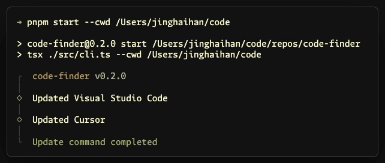
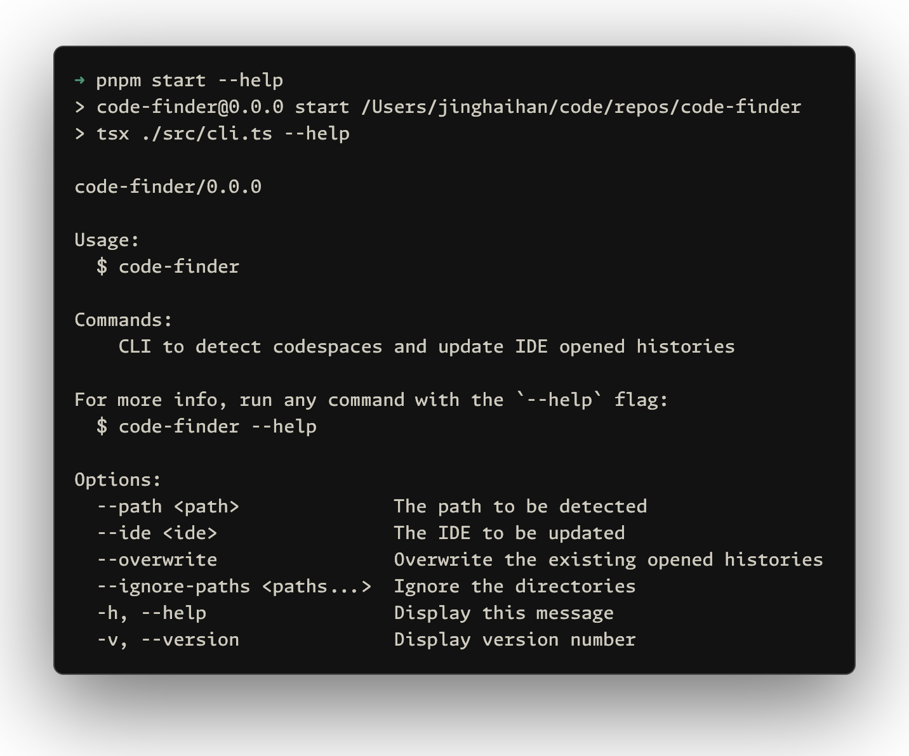

# code-finder

[![npm version][npm-version-src]][npm-version-href]
[![JSDocs][jsdocs-src]][jsdocs-href]
[![License][license-src]][license-href]

CLI to detect codespaces and update IDE opened histories.

<p align='center'>

</p>

## Usage

```sh
npx code-finder [mode] [options]
```

### Modes

- `update` - Update IDE opened histories with detected codespaces
- `detect` - Detect and display codespaces without updating IDE histories
- `combine` - Combine detected codespaces with existing IDE histories

<p align='center'>

</p>

## License

[MIT](./LICENSE) License © [jinghaihan](https://github.com/jinghaihan)

<!-- Badges -->

[npm-version-src]: https://img.shields.io/npm/v/code-finder?style=flat&colorA=080f12&colorB=1fa669
[npm-version-href]: https://npmjs.com/package/code-finder
[npm-downloads-src]: https://img.shields.io/npm/dm/code-finder?style=flat&colorA=080f12&colorB=1fa669
[npm-downloads-href]: https://npmjs.com/package/code-finder
[bundle-src]: https://img.shields.io/bundlephobia/minzip/code-finder?style=flat&colorA=080f12&colorB=1fa669&label=minzip
[bundle-href]: https://bundlephobia.com/result?p=code-finder
[license-src]: https://img.shields.io/badge/license-MIT-blue.svg?style=flat&colorA=080f12&colorB=1fa669
[license-href]: https://github.com/jinghaihan/code-finder/LICENSE
[jsdocs-src]: https://img.shields.io/badge/jsdocs-reference-080f12?style=flat&colorA=080f12&colorB=1fa669
[jsdocs-href]: https://www.jsdocs.io/package/code-finder
