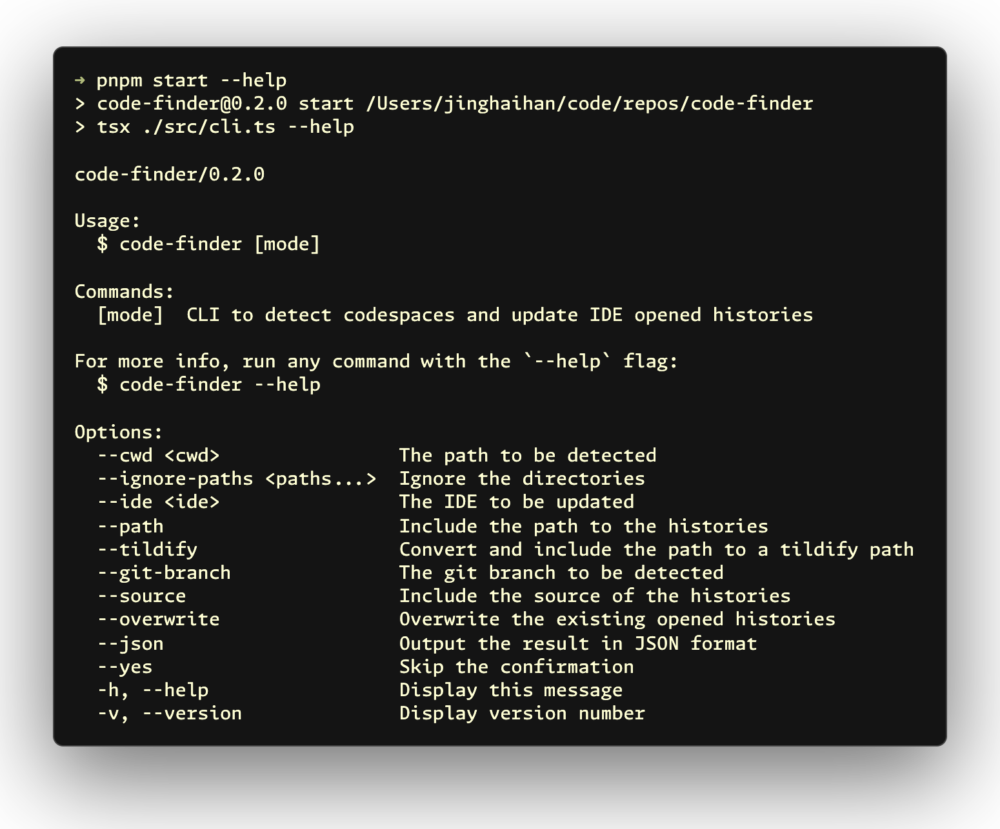

# <samp><b>code-finder</b></samp>

[![npm version][npm-version-src]][npm-version-href]
[![bundle][bundle-src]][bundle-href]
[![JSDocs][jsdocs-src]][jsdocs-href]
[![License][license-src]][license-href]

<p align='center'>

</p>

## <samp><b>Usage</b></samp>

```sh
npx code-finder --path <path> --ide <ide> [--overwrite]
```

- `--path <path>` - The directory path to scan for codespaces (required)
- `--ide <ide>` - The IDE to update history for (optional, can be used multiple times, defaults to VSCode and its forks)
- `--overwrite` - Overwrite existing opened histories (optional, defaults to true)

## <samp><b>License</b></samp>

[MIT](./LICENSE) License © [jinghaihan](https://github.com/jinghaihan)

<!-- Badges -->

[npm-version-src]: https://img.shields.io/npm/v/code-finder?style=flat&colorA=080f12&colorB=1fa669
[npm-version-href]: https://npmjs.com/package/code-finder
[npm-downloads-src]: https://img.shields.io/npm/dm/code-finder?style=flat&colorA=080f12&colorB=1fa669
[npm-downloads-href]: https://npmjs.com/package/code-finder
[bundle-src]: https://img.shields.io/bundlephobia/minzip/code-finder?style=flat&colorA=080f12&colorB=1fa669&label=minzip
[bundle-href]: https://bundlephobia.com/result?p=code-finder
[license-src]: https://img.shields.io/badge/license-MIT-blue.svg?style=flat&colorA=080f12&colorB=1fa669
[license-href]: https://github.com/jinghaihan/code-finder/LICENSE
[jsdocs-src]: https://img.shields.io/badge/jsdocs-reference-080f12?style=flat&colorA=080f12&colorB=1fa669
[jsdocs-href]: https://www.jsdocs.io/package/code-finder
